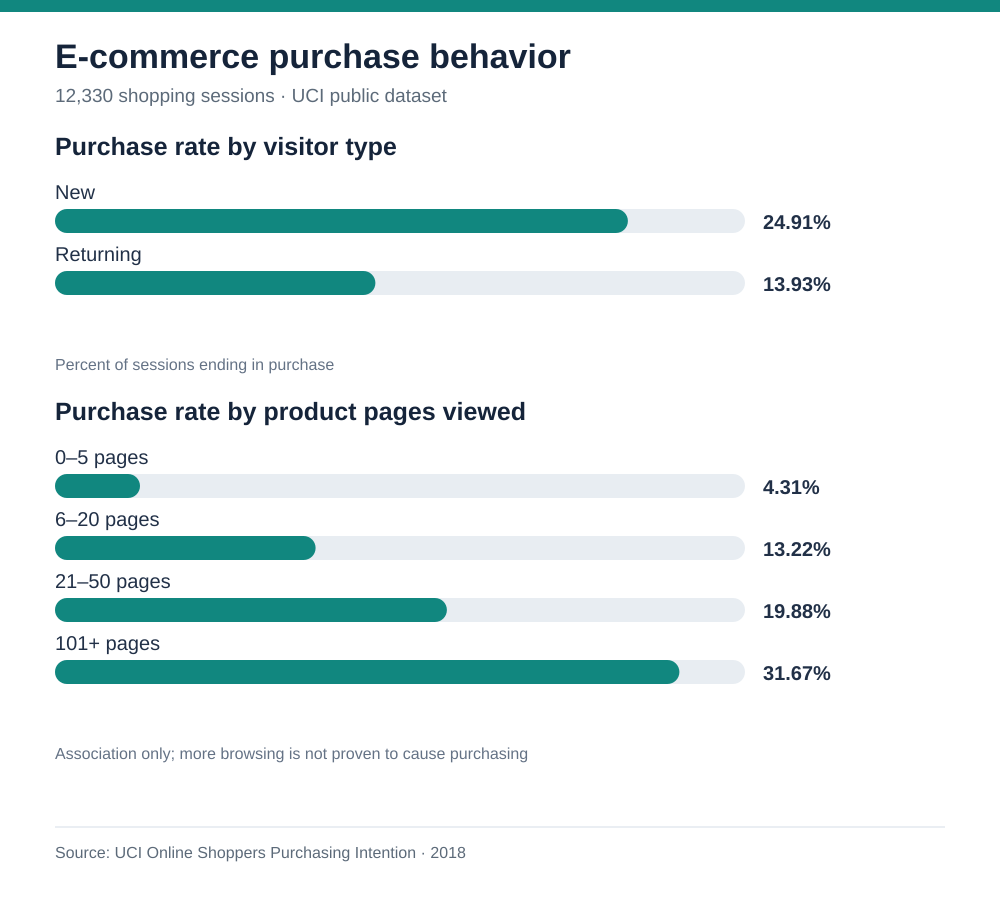
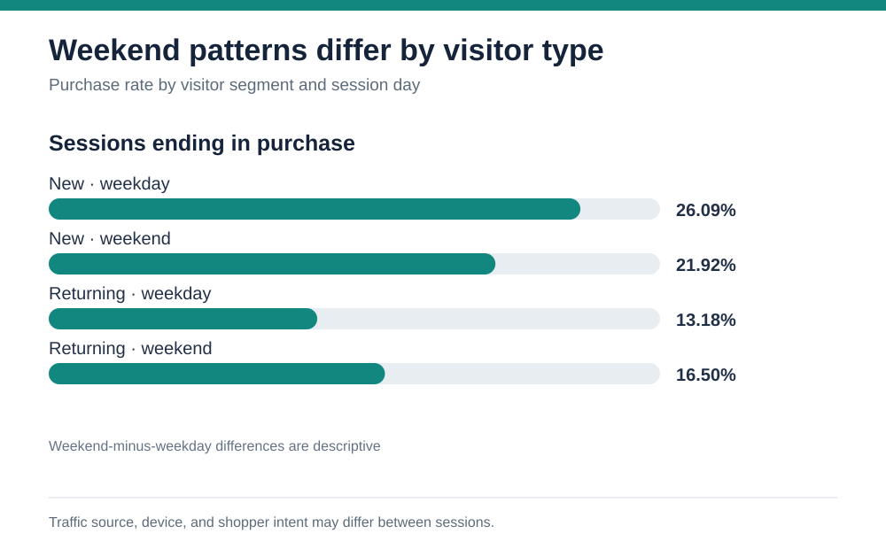
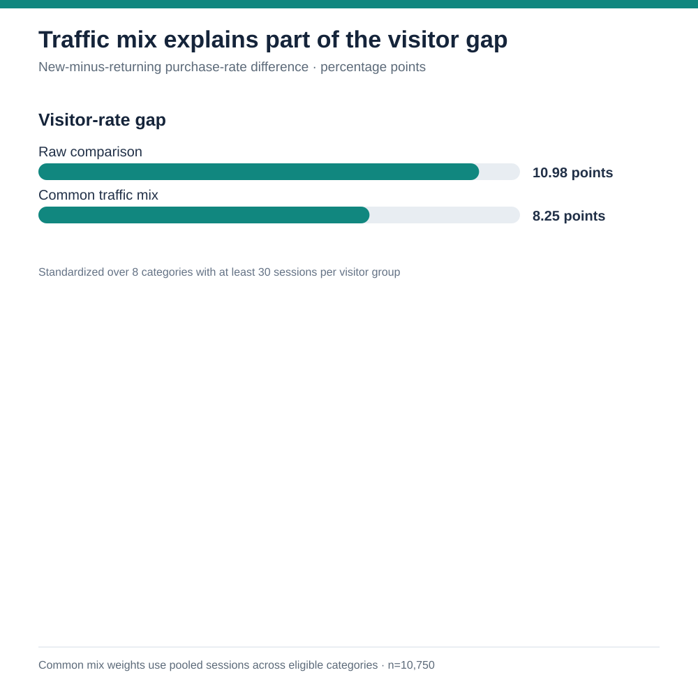

# E-commerce purchase behavior



## Executive brief

**Decision question:** Where should an e-commerce team look first for purchase-rate improvement?

**Finding:** New visitors purchased in **24.91%** of sessions versus **13.93%** for returning visitors, a **10.98 percentage-point gap**. The gap remains about **10.85 points** after comparing both groups across the same nine months with at least 30 new-visitor sessions. Each month is weighted by its pooled New and Returning sessions; February is excluded because it has only one new-visitor session. This is a descriptive lead, not a causal result.

**Recommended next action:** Audit the returning-visitor journey by acquisition source and device, then test one specific change such as clearer product re-entry or cart messaging. Define purchase rate as the primary outcome and monitor guardrails such as average order value and bounce rate.

## Interview walkthrough

> I analyzed 12,330 sessions and defined conversion as sessions with `Revenue = TRUE` divided by all sessions in a group. New visitors converted at 24.91%, compared with 13.93% for returning visitors. Because the groups may come from different traffic mixes, I standardized them across the same eight traffic categories; the gap narrowed to 8.25 points but did not disappear. I also checked whether weekend behavior was consistent across the two groups and found opposite directions, which argues against one blanket timing change. These are observational patterns, so I would investigate the returning-visitor experience and then test one change with a clear conversion metric and guardrails. This dataset cannot establish cause or estimate revenue impact.

## Analysis design

The [UCI Online Shoppers Purchasing Intention dataset](https://archive.ics.uci.edu/dataset/468/online+shoppers+purchasing+intention+dataset) contains **12,330 sessions**. Each row is a session, and `Revenue = TRUE` is treated as a session ending in purchase. The core KPI is **purchasing sessions ÷ all sessions** in a segment. The overall rate is **1,908 ÷ 12,330 = 15.47%**.

| Visitor segment | Sessions | Purchasing sessions | Purchase rate |
| --- | ---: | ---: | ---: |
| New | 1,694 | 422 | 24.91% |
| Returning | 10,551 | 1,470 | 13.93% |
| Other | 85 | 16 | 18.82% |

The approximate 95% interval for the **new-minus-returning rate gap** is **8.82 to 13.14 percentage points**, using a simple independent-proportions standard error. It describes sampling uncertainty under that assumption; it does not remove campaign, product, or intent differences between segments.

Product-page browsing depth also tracks with purchase rate: **4.31%** for 0–5 pages, **13.22%** for 6–20, **19.88%** for 21–50, **22.04%** for 51–100, and **31.67%** for 101+. This supports a product-discovery investigation, but forcing more page views is not a justified recommendation. Buyers may browse more because they already intend to buy.

### A segment interaction changes the story



The weekend pattern differs by visitor type. New visitors purchased in **26.09%** of weekday sessions and **21.92%** of weekend sessions. Returning visitors purchased in **13.18%** of weekday sessions and **16.50%** of weekend sessions. Approximate 95% intervals for the weekend-minus-weekday differences are **−8.62 to +0.28 points** for new visitors and **+1.65 to +4.98 points** for returning visitors. This points toward testing visitor-specific timing or messaging, not applying a single weekend rule to everyone.

### Traffic mix explains part, but not all, of the visitor gap



The raw new-minus-returning gap is **10.98 percentage points**. I then compared both visitor groups across the same eight `TrafficType` categories, keeping categories with at least 30 sessions in each group and weighting each category by its pooled session count. Across those **10,750 sessions**, the standardized purchase rates are **23.13% for new visitors** and **14.88% for returning visitors**, leaving an **8.25-point gap**. The gap is smaller, so traffic mix accounts for part of the raw difference under this method.

The category codes are anonymized, so they cannot be translated into named marketing channels. The pattern also reverses in category 11 (11.76% new versus 21.03% returning); the pooled result should not be read as a rule that holds in every source. This is a descriptive, common-mix comparison rather than a causal or fully adjusted estimate.

## Quality and interpretation checks

- The CSV has **no blank fields**. It has **125 rows with identical feature values**; they remain because equal values do not prove duplicate sessions and the source describes sessions from distinct users.
- February has just **one new-visitor session**, so it is excluded from the month-standardized comparison. The other nine reported months have at least 30 new-visitor sessions.
- The dataset has no transaction amount, marketing spend, full timestamp, or experiment assignment. It cannot quantify revenue lift, ROI, or causal impact.
- The 85-session `Other` visitor segment is too small to anchor a recommendation.
- The weekend differences are observational and may reflect differences in traffic source, device mix, or shopper intent. They motivate a segmented experiment; they do not establish a weekend effect.

## Reproduce

From this folder, run:

```text
python analyze.py
python build_charts.py
```

`analyze.py` validates the expected columns, purchase flag, row count, and blank fields, then calculates the KPI tables and writes [`summary.json`](summary.json). It stops if session or purchase totals fail to reconcile across visitor and product-page groups. Its common-month comparison weights only pooled New and Returning sessions, excluding the small Other group. `build_charts.py` reads the summary and regenerates `chart.svg`, `visitor-weekend.svg`, and `visitor-traffic.svg`, so the visual figures come from the CSV calculations rather than separate chart constants. Both scripts use only the Python standard library. `queries.sql` provides equivalent core checks for SQLite after importing the CSV as `sessions` and mapping Boolean values to 0/1. The standalone [case-study page](index.html) offers a visual narrative, and [`summary.json`](summary.json) exposes the computed figures behind it.

The root-level `build_charts.py` handles the Washington EV and NYC 311 summary visuals. It no longer writes over the e-commerce charts.

## Review iterations

- Added an inline chart after portfolio feedback that the findings should be easier to scan.
- Checked whether the new-versus-returning visitor gap was driven by the dataset's month mix; the gap remained similar across the nine months with enough new-visitor sessions.
- Split weekend patterns by visitor type. The directions differ, so the recommended next step now calls for a segment-specific test instead of a single broad change.
- Checked visitor purchase rates across traffic categories. A common-mix comparison narrowed the gap from 10.98 to 8.25 points and exposed one category with a reversed pattern, so the recommendation now treats channel mix as a plausible partial explanation.

**Source credit:** Sakar, C. & Kastro, Y. (2018), *Online Shoppers Purchasing Intention Dataset*, UCI Machine Learning Repository, DOI [10.24432/C5F88Q](https://doi.org/10.24432/C5F88Q), CC BY 4.0. This is a public-data practice analysis, not client or employer work.
