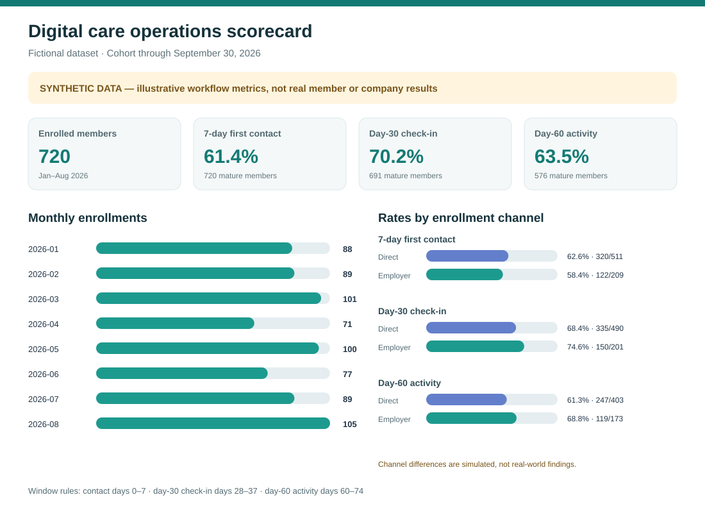

# Digital care operations scorecard



> **SYNTHETIC DATA.** Every member and event in this case study is fictional and generated for portfolio practice. It is not Calibrate data, patient data, or evidence about any real care program.

## Executive brief

**Decision question:** Can an operations team see whether newly enrolled members receive timely contact and complete early program touchpoints, while accounting for follow-up time and data quality?

This case study demonstrates a recurring scorecard for a fictional digital care program. It tracks monthly enrollments, first coach contact, a day-30 check-in, and observed day-60 activity. The last two measures are operational touchpoints, not clinical outcomes or proof of member health improvement.

The scorecard separates Direct and Employer enrollment channels and uses cohort-maturity cutoffs, so members who have not had time to reach a milestone are not treated as missed. All rates are illustrative because the source data is synthetic. The appropriate action with real data would be to validate definitions with operations and clinical partners, then investigate a persistent gap before changing a workflow.

In this generated run, 7-day first contact is **61.4% (442/720)**, the day-30 check-in is **70.2% (485/691)**, and day-60 activity is **63.5% (366/576)**. The changing denominators reflect the maturity cutoffs. These values demonstrate calculation and reporting only.

| Measure | Direct | Employer |
| --- | ---: | ---: |
| 7-day first contact | 62.6% (320/511) | 58.4% (122/209) |
| Day-30 check-in | 68.4% (335/490) | 74.6% (150/201) |
| Day-60 activity | 61.3% (247/403) | 68.8% (119/173) |

## KPI definitions

| KPI | Numerator | Denominator | Eligibility and window |
| --- | --- | --- | --- |
| 7-day first contact | Eligible members with a completed coach-contact event 0–7 days after enrollment | Members enrolled on or before September 23, 2026 | Calendar-day difference from enrollment; the analysis snapshot is September 30, 2026. |
| Day-30 check-in | Eligible members with a completed check-in 28–37 days after enrollment | Members enrolled on or before August 24, 2026 | A 10-day milestone window with a one-week grace period around day 30. |
| Day-60 activity | Eligible members with an observed activity event 60–74 days after enrollment | Members enrolled on or before July 18, 2026 | A two-week observation window; this is an engagement proxy, not program retention or clinical benefit. |
| Monthly enrollment | Members grouped by enrollment month | All synthetic enrollments in the month | Cohort volume only; no seasonality claim is made from this generated example. |

## Role-relevant skills shown

- SQL aggregation by month and channel, with explicit event windows and eligible-cohort denominators.
- Excel scorecard with a formula-driven member build, editable source tabs, channel comparisons, and monthly enrollment chart. [Open the workbook](outputs/01a0e95f-1c5a-7e80-94bb-cdfd7e7facc1/member-care-scorecard.xlsx).
- Repeatable KPI definitions, source-to-output traceability, and quality checks for duplicate keys, missing fields, orphan events, and impossible dates.
- An operations-facing explanation of how to interpret the scorecard and when to investigate a gap.

## 90-second walkthrough

> I built a small operations scorecard using a deterministic synthetic member roster and event log. Each member appears once in the enrollment table, while the event table has one row per recorded touchpoint. I first checked keys, required fields, event joins, and date boundaries. Then I defined three measures: contact within seven days, a day-30 check-in in a ten-day window, and activity in a two-week window around day 60. Each denominator includes only enrollments old enough to complete the full window by the September 30 snapshot. I compared rates across the two simulated enrollment channels and included monthly intake volume. The generated file shows a lower simulated early-contact rate for Employer than Direct, but that is only a test of the reporting logic. With real data, I would confirm definitions with the operations owners, reconcile counts to the source system, and investigate patterns with the teams before recommending a workflow change. The dataset contains no real members or clinical outcomes.

## Data model and quality

- [`members.csv`](data/members.csv) has one row per fictional enrollment, with a synthetic ID, enrollment date, channel, and assigned care team.
- [`events.csv`](data/events.csv) has one row per completed or observed touchpoint, keyed to the synthetic member ID.
- `generate_data.py` creates 720 members and their events from a fixed random seed. The fictional channel probabilities are assumptions used to make the segment scorecard demonstrable; they are not measured benchmarks.
- `analyze.py` checks key uniqueness, required values, orphan events, event dates before enrollment, and events after the snapshot. It stops if a check fails.
- `queries.sql` contains SQLite versions of the monthly enrollment report, mature-cohort scorecard, and core quality checks.

## What this does and does not show

This is an operations-reporting example, not a clinical outcomes study. It contains no weight, medication, diagnosis, or other health outcome fields. A real deployment would require approved definitions, access controls, appropriate privacy protections, source-to-report reconciliation, and review by the teams accountable for each measure. A channel difference in this simulation should not be interpreted as a real operational issue.

## Reproduce

From this folder, run:

```text
python generate_data.py
python analyze.py
```

The first command recreates the deterministic CSVs in `data/`. The second validates them, prints the scorecard, and regenerates `summary.json` and `scorecard.svg`. `queries.sql` shows the equivalent SQLite logic after importing the two CSVs as `members` and `events`. The linked Excel workbook uses formulas across its `Members`, `Events`, and `Member Build` tabs to calculate the same measures.

This public portfolio case study uses only synthetic data and is not client or employer work.

