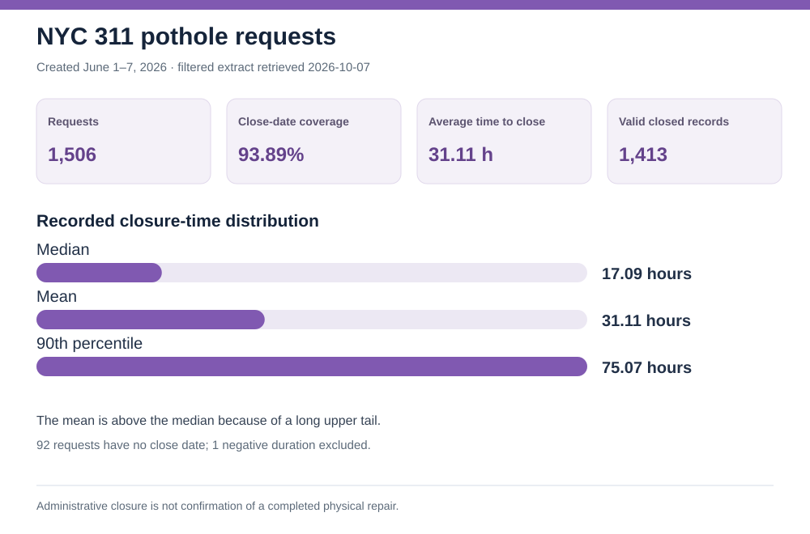

# NYC 311 service-request operations


## Executive brief

**Decision question:** Which request categories dominate incoming volume, and where do long closure tails warrant an operations review?

**Finding:** **Illegal Parking** generated **13,694** requests in the June 1–7, 2026 cohort, or **16.92%** of all **80,941** requests. Its median recorded time to close was **1.64 hours**, while **Damaged Tree** had a **47.77-hour** median and **Unsanitary Condition** had a **174.38-hour** median among requests with valid close times. These are fundamentally different workflows, so the differences are leads for investigation, not a performance ranking.

**Recommended next action:** Review intake staffing for high-volume, short-cycle types; inspect handoffs and field scheduling for long-cycle types. For an actual performance scorecard, report **volume, share with a close date, median, and 90th percentile together** within each complaint type.

## Cohort and KPI definitions

The [NYC Open Data 311 dataset](https://data.cityofnewyork.us/d/erm2-nwe9) was filtered to requests **created June 1–7, 2026**. One row represents one service request; all **80,941 unique keys** in the extract are distinct. Recorded closure hours equal `closed_date − created_date`. The **median** is the middle valid closed request; the **90th percentile** shows the long tail. Close-date coverage is requests with a close timestamp ÷ all requests of that type.

| Complaint type | Requests | Close-date coverage | Median hours | 90th-percentile hours |
| --- | ---: | ---: | ---: | ---: |
| Illegal Parking | 13,694 | 100.00% | 1.64 | 7.93 |
| Noise – Residential | 8,141 | 100.00% | 1.27 | 6.07 |
| Damaged Tree | 2,766 | 83.98% | 47.77 | 358.05 |
| Unsanitary Condition | 2,630 | 97.83% | 174.38 | 585.45 |

The long tail matters: for Damaged Tree, the 90th percentile among valid closed cases is about **15 days**. A median alone would conceal that spread. Its **83.98% close-date coverage** also means the displayed duration excludes many requests without a close timestamp.

## Pothole closure-time cut

The original extract did not include `descriptor`, so it could not separate potholes from the broader `Street Condition` category. I added a filtered extract with that field for the same June 1–7 creation window. It contains **1,506** requests identified as `Street Condition` / `Pothole` and was retrieved from NYC Open Data on **October 7, 2026**.

| Pothole measure | Result |
| --- | ---: |
| Requests | 1,506 |
| Close-date coverage | 93.89% (1,414 / 1,506) |
| Valid closed requests in duration statistics | 1,413 |
| Average recorded time to close | 31.11 hours |
| Median recorded time to close | 17.09 hours |
| 90th-percentile recorded time to close | 75.07 hours |

There were **92** requests without a close date and **one** negative duration, which was excluded from the mean and percentiles. The average exceeds the median because the closure-time distribution has a long upper tail. The close timestamp is an administrative record, not confirmation of physical repair. This filtered extract was retrieved later than the general 311 cohort file, so the two summaries reflect different source retrieval dates. The source updates daily and values can change.



## Quality and interpretation checks

- **3,649** requests have no close date. **14** have a close timestamp before the creation timestamp; those 14 are excluded from duration summaries.
- `closed_date` is an administrative system event. It is not proof of physical repair or resident satisfaction.
- Open requests are missing from the duration percentiles. This can make slower categories look faster, so coverage appears beside duration.
- The seven-column full-cohort extract omits `descriptor`; the separately linked filtered file contains only pothole records and the fields needed for closure-time analysis. It excludes address and precise-location fields.
- This is one week, not an annual average. NYC updates the source daily, and fields can change after extraction.
- Borough comparisons require controlling for complaint mix and agency workflow before drawing performance conclusions.

## Reproduce

Run these commands in this folder. Both Python scripts use only the standard library:

```text
python analyze.py
python analyze.py data/potholes_2026_06_01_to_07_retrieved_2026_10_07.csv
python build_charts.py
```

The first analysis writes [`summary.json`](summary.json) from the included seven-column full-cohort extract. The second writes [`pothole_summary.json`](pothole_summary.json) from the descriptor-specific filtered extract. The chart builder reads those summaries to regenerate `chart.svg` and `potholes.svg`. `queries.sql` provides SQLite checks. The filtered file omits addresses and precise-location fields. NYC Open Data documents [Problem Detail (`descriptor`)](https://data.cityofnewyork.us/Social-Services/311-Service-Requests-from-2020-to-Present/erm2-nwe9/about_data). The filtered records were retrieved using this creation-date and descriptor filter:

```text
created_date >= '2026-06-01T00:00:00'
and created_date < '2026-06-08T00:00:00'
and complaint_type = 'Street Condition'
and descriptor = 'Pothole'
```

The [case-study page](index.html) gives a visual overview. **Source:** NYC Open Data, *311 Service Requests from 2020 to Present*; full-cohort extract accessed September 28, 2026 and filtered pothole extract retrieved October 7, 2026. This is a public-data practice analysis, not client or employer work.
