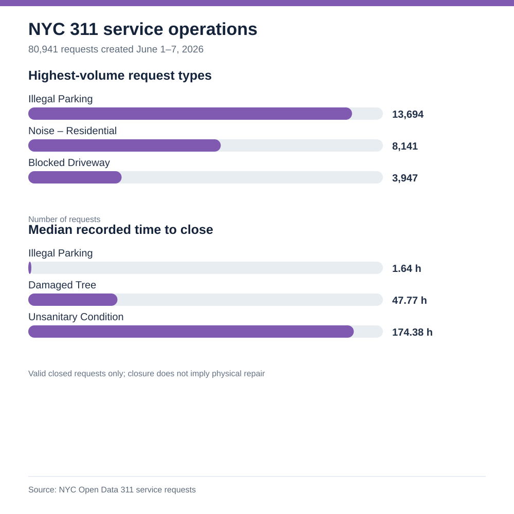

# NYC 311 service-request operations



**Question:** Which complaint types drive one week's 311 workload, and how do administrative closure times vary?

**Source:** [NYC Open Data, 311 Service Requests from 2020 to Present](https://data.cityofnewyork.us/d/erm2-nwe9), accessed September 28, 2026. The included extract selects only `unique_key`, `created_date`, `closed_date`, `agency`, `complaint_type`, `borough`, and `status` for requests created June 1–7, 2026. No addresses or personal details are included.

## Results

- 80,941 requests; all 80,941 unique keys are distinct.
- 3,649 requests have no close date in the extract. Fourteen have a close timestamp earlier than the creation timestamp and are excluded from closure-time medians.
- The highest-volume type is **Illegal Parking** (13,694 requests, 16.92% of the week's total), followed by **Noise – Residential** (8,141) and **Noise – Street/Sidewalk** (5,271).
- Median recorded time to close among requests with valid timestamps: Illegal Parking **1.64 hours**; Noise – Residential **1.27 hours**; Damaged Tree **47.77 hours**; Unsanitary Condition **174.38 hours**.

## Business interpretation

Request types differ in workflow and agency ownership. Parking and noise reports are high-volume and short-cycle, so they benefit from queue staffing and rapid triage. Damaged-tree and sanitation-condition requests have longer recorded closure times and deserve investigation into handoffs, scheduling, and field capacity. These comparisons should be made within complaint type before labeling an agency or borough efficient or inefficient.

## Limits

`closed_date` marks administrative closure in the 311 system, not necessarily completion of physical work or resident satisfaction. This is one week of requests, not a representative annual sample. Open requests are excluded from median closure times, which can make slower categories appear faster. NYC says the dataset is updated daily and field values can change; this extract is a dated snapshot.

## Reproduce

Run `python analyze.py` from this folder. It uses only Python's standard library. `queries.sql` provides SQLite-friendly checks. The extract comes from NYC's Socrata API with this filter:

```text
created_date >= '2026-06-01T00:00:00' and created_date < '2026-06-08T00:00:00'
```
