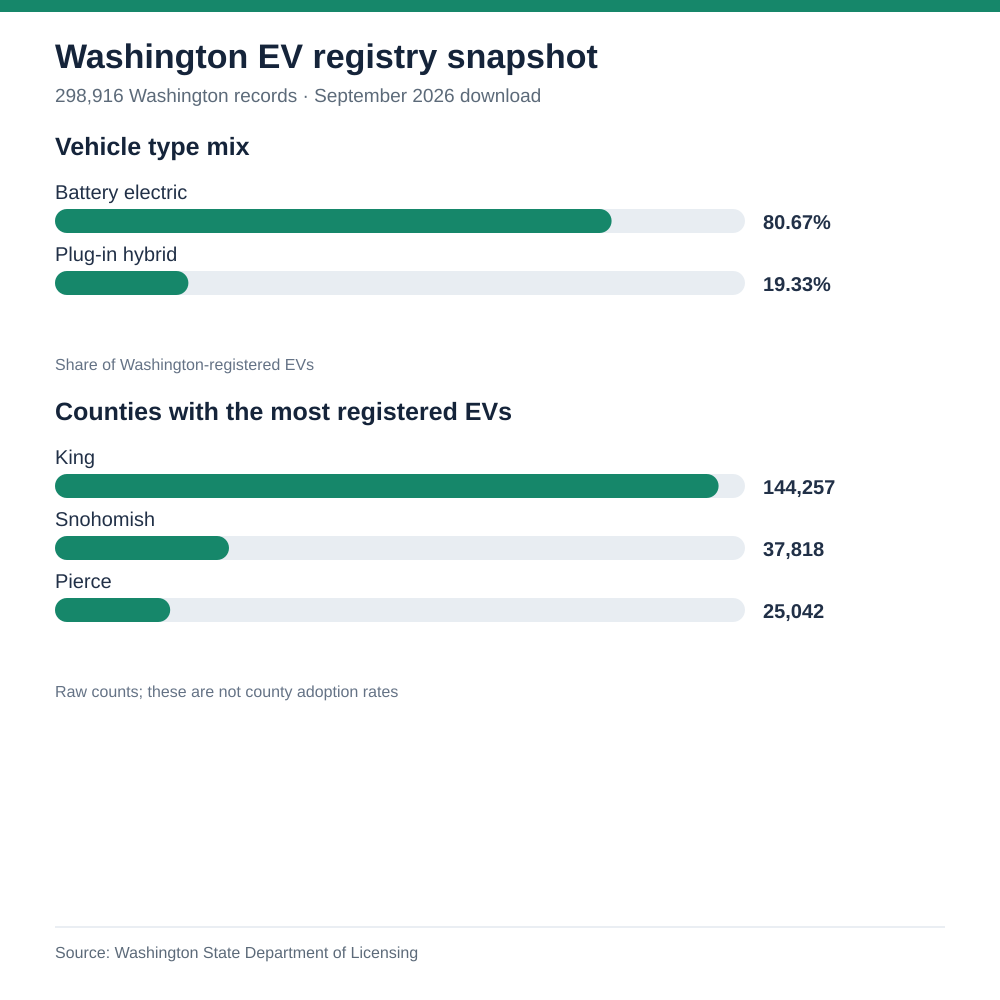

# Washington electric vehicle registry snapshot

## Executive brief

**Decision question:** Which Washington markets merit deeper investigation for EV charging investment?

**Finding:** Of **298,916** Washington-registered EVs in this snapshot, **80.67%** are battery electric. King, Snohomish, and Pierce together account for **69.29%** of the state's registered EVs. Concentration identifies where potential demand is large; it does not establish charging gaps or site economics.

**Recommended next action:** Shortlist those three counties for a second-stage analysis combining charger locations, EVs per charger, total vehicle registrations, traffic flows, and site feasibility. Compare candidate neighborhoods within counties before choosing a station location.

### Proposed second-stage screening

The registry supports a county-level starting point, not a charger investment ranking. I would add these measures before advancing a market:

| Measure | Definition | Additional data and decision use |
| --- | --- | --- |
| EV adoption context | Registered EVs ÷ all registered passenger vehicles × 1,000 | A same-date vehicle-registration denominator distinguishes a large county from a county with a high EV share. |
| Public charging supply | Public charging ports ÷ registered EVs × 1,000, split by Level 2 and DC fast charging | A dated public-charger inventory provides a first-pass supply comparison. Port counts do not show utilization, uptime, or home charging access. |
| Candidate-area screen | EVs and traffic activity within a defined drive-time area, alongside site and grid feasibility | Finer-grained geography, traffic counts, candidate parcels, and utility capacity are needed to assess specific locations. County totals alone cannot select a site. |

I would first verify that the vehicle and charger snapshots align in time and geography. Counties would advance only as candidates for neighborhood-level research; the current registry does not show an unmet charging need or forecast station performance.

## Analysis design

The [Washington State Department of Licensing EV population file](https://data.wa.gov/d/f6w7-q2d2) is a **current registration snapshot**. The September 28, 2026 download has **299,705** records, of which **298,916** have `State = WA`. The Washington subset has **298,916 distinct DOL vehicle IDs**, so the count uses one row per recorded vehicle ID.

| County | Registered EVs | Share of WA EVs | Battery-electric share within county |
| --- | ---: | ---: | ---: |
| King | 144,257 | 48.26% | 82.80% |
| Snohomish | 37,818 | 12.65% | 84.37% |
| Pierce | 25,042 | 8.38% | 78.75% |
| Clark | 18,782 | 6.28% | 77.23% |

Statewide, **241,125** vehicles are battery electric and **57,791** are plug-in hybrid. Tesla is the largest make at **122,573** records, or about **41.00%** of the Washington subset. The top five counties account for **79.25%** of registered EVs.

## Quality and interpretation checks

- The `State = WA` filter removes **789** out-of-state records before calculating statewide shares.
- The reproduction script reports blank vehicle IDs, repeated nonblank IDs, blank counties, and blank vehicle-type fields separately. The SQL quality query uses the same checks; blank IDs are not counted as distinct vehicles.
- Model year describes the vehicle, not when it was sold or registered. Model-year counts are **not** annual adoption or sales figures.
- County EV counts are **not adoption rates**. That would require a denominator such as total registered vehicles or population.
- The source changes over time. These figures describe the dated download, not a permanent total.

## Reproduce

The full CSV is about 82 MB and is excluded from the repository. Download it from the [data portal](https://data.wa.gov/d/f6w7-q2d2), save it as `data/ev_population.csv`, and run `python analyze.py`. The script uses only Python's standard library. You can also pass an alternate CSV path as its first argument. `queries.sql` shows equivalent registry checks in SQLite. The [case-study page](index.html) gives a quick visual summary.

**Source:** Washington State Department of Licensing, *Electric Vehicle Population Data*, accessed September 28, 2026, [ODbL 1.0](https://opendatacommons.org/licenses/odbl/1-0/). This is a public-data practice analysis, not client or employer work.
